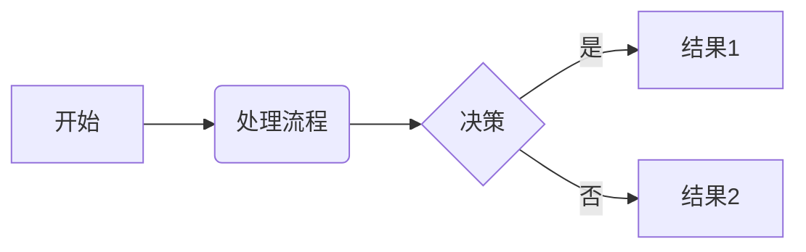
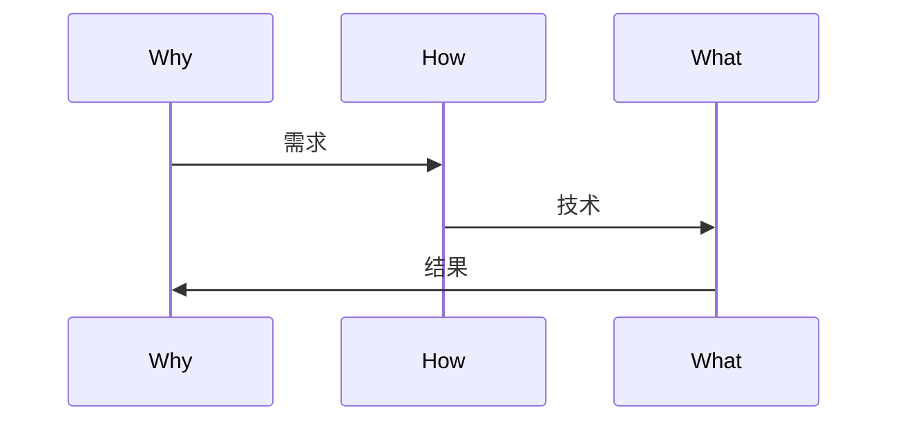

# 课程项目流程图

## 技术可行性分析

```mermaid
graph LR
   A[开始] --> B(处理流程)
   B --> C{决策}
   C -->|是| D[结果1]
   C -->|否| E[结果2]
```

## 战略价值演示

```mermaid
sequenceDiagram
    participant A as Why
    participant B as How
    participant C as What
    A->>B: 需求
    B->>C: 技术
    C->>A: 结果
```
